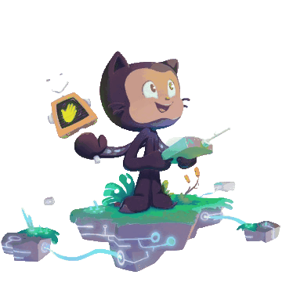

<p align="center">
   
</p>
<h1>Hi 👋, Dibyajyoti Mishra, this side.</h1>
<p align="center"></p>
<h2>Thanks for stopping by. </h2>

<p align="left">
 


</p>

<h2>My Recent Blogs</h2>
   
 <a target="_blank" href="https://github-readme-medium-recent-article.vercel.app/medium/@dibyajyotimishra/0"></a>
 <a target="_blank" href="https://github-readme-medium-recent-article.vercel.app/medium/@dibyajyotimishra/1"></a> <br>

<details><summary>Other Details</summary>
<br />
<p align="left">

 
 
 <a href="https://github.com/DibyajyotiMishra"></a>
</p>
</details>

<br />

<details><summary>GitHub Stats</summary>
<br />
<p align="left">
 
  

  <!--START_SECTION:waka-->
```text
TypeScript   4 hrs 42 mins   █████████████▒░░░░░░░░░░░   53.36 % 
CSS          3 hrs 27 mins   █████████▓░░░░░░░░░░░░░░░   39.17 % 
JSON         25 mins         █▒░░░░░░░░░░░░░░░░░░░░░░░   04.83 % 
HTML         9 mins          ▒░░░░░░░░░░░░░░░░░░░░░░░░   01.77 % 
XML          4 mins          ▒░░░░░░░░░░░░░░░░░░░░░░░░   00.85 % 
```
<!--END_SECTION:waka-->

</p>
</details>

<br />

<details><summary>GitHub Trophies</summary>
<br />
<p align="left">

</p>
</details>

<br />


<br />

<h4>Today's Motivation</h4>
<p align="center">
   
</p>

<br />

<p align="center">
   
</p>

## Social Media Handles:

<div>
 <a href="https://twitter.com/dibyajyotim_" ></a>
 <a href="https://dibyajyoti.hashnode.dev/" ></a>
 <a href="mailto:dibyajyotimishra14@gmail.com" ></a>
 <a href="https://www.linkedin.com/in/dibyajyotim/" ></a>
</div>
